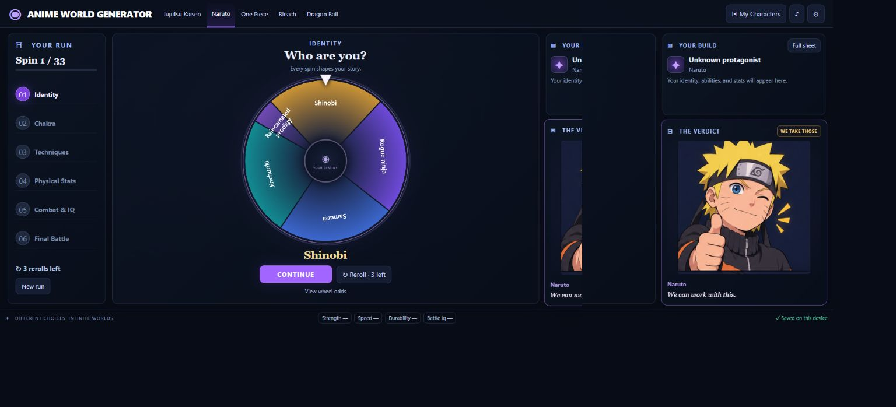

# Anime World Generator

**Version 1.3** — Spin your way into an anime universe, build a character, and let the meme reactions judge your luck.



Choose an anime and discover your identity, exact age, powers, mastery, stats, and final opponent. Earlier results unlock extra wheels, so every run creates a different build.

## Anime worlds

| Anime | Reaction characters | Power system |
| --- | --- | --- |
| Jujutsu Kaisen | Yuji & Gojo | Cursed energy and cursed techniques |
| Naruto | Naruto & Sasuke | Chakra and signature jutsu |
| One Piece | Luffy & Zoro | Signature moves, Devil Fruits, and Haki |
| Bleach | Ichigo & Rukia | Spiritual pressure and spiritual techniques |
| Dragon Ball | Goku & Vegeta | Ki and signature techniques |
| Fairy Tail | Natsu & Lucy | Magic, guild bonds, and spells |
| My Hero Academia | Deku & Bakugo | Quirks, drawbacks, and support equipment |
| Attack on Titan | Eren & Mikasa | ODM combat, squad skills, and conditional Titan forms |
| Hunter × Hunter | Gon & Killua | Nen, restrictions, aura, and abilities |

## Features

Version 1.3 adds Male, Female, and Random appearance choices before your first spin. Random is resolved once per run and saved. Completed runs automatically reveal a layered final battle scene with your actual rolled opponent: you stand victorious over their defeated pose, or kneel below their victorious pose. All 93 opponent entries have specific artwork in both poses, including squads. Open **View Character** or a saved build to see the same scene again, then choose **Character stats** or **Clean portrait**.

Version 1.2 adds four worlds, evolving layered character portraits, confirmed deletion from My Characters, and self-recognition when the wheel picks a reaction character. The anime selector is a compact dropdown to keep all nine worlds accessible on phones.

The game also includes player-aware enemy verdicts, expanded character-specific opinions, and rare **lost Zoro** cameos. Enemy boosts are bad for your odds even when a character enjoys the challenge. Dialogue avoids recent repeats within a run. Zoro can visit the other eight anime with a local character reacting to his arrival; the cameo is cosmetic, has a cooldown, and never changes your roll or stats.

- **Connected wheels:** earlier results determine which spins appear next.
- **Exact-age generation:** spin an age range, then a specific year. Ancient characters receive an additional range wheel.
- **Multiple techniques:** roll your technique count, then discover each unique technique and its mastery separately.
- **Detailed stats:** energy reserves, control, output, recovery, strength, durability, speed, stamina, reflexes, combat skill, weapon skill, IQ, and battle IQ.
- **Contextual meme reactions:** two characters per anime alternate reactions, with duo reactions for special results and battle outcomes.
- **Three rerolls per run:** take another chance before accepting a result.
- **Weighted final battles:** your build, enemy, enemy condition, and starting advantage affect your victory odds.
- **Evolving portraits:** locally composed artwork previews pending rolls and updates age, world outfit, affiliation tint, origin coloring, equipment motifs, and power effects. Click the portrait to enlarge it. Saved builds reconstruct the same illustration; no runtime AI service or key is needed. The illustration represents supported visual traits, not an exact drawing of every power or creature anatomy.
- **Delete saved characters:** each library entry has a Delete button and confirmation. Cancel keeps it; deleting does not replace your active run.
- **Local autosave:** resume a run and keep up to 50 completed characters.
- **Character downloads:** export a build as a readable text file.
- **Responsive GUI:** desktop controls fit the viewport; smaller screens use Wheel, Character, and Reactions tabs.
- **Automatic mobile verdicts:** after a spin, a pop-up shows the result and reaction with Continue, Reroll, and Close controls. Closing keeps the result pending. Turning meme reactions Off disables the pop-up.
- **Customizable experience:** optional sound, fast spins, and adjustable meme reactions. Reduced-motion preferences are respected.

## Play in your browser

No account, installation, build step, or internet connection is required after downloading the files.

1. Download the source or obtain the browser-edition ZIP.
2. **Extract the entire ZIP** into a folder.
3. Double-click **index.html** to open the game in a modern browser.
4. Keep the HTML, CSS, JavaScript, and image files together.

Version **1.3** appears in the app footer and browser title.

## How to play

1. Select an anime from the top navigation.
2. Choose **Male**, **Female**, or **Random**, then click **Spin the Wheel**.
3. Review the result and meme verdict.
4. Click **Continue**, or spend a **Reroll** before continuing.
5. Use **Full sheet** to inspect your character and **View wheel odds** to check probabilities.
6. Complete your character, face your opponent, and spin for the final outcome.
7. Find completed builds in **My Characters** and download any you want to keep.

Starting a new run replaces the unfinished run. Completed characters remain in your library.

## Windows executable

The game can also be packaged as **Anime World Generator 1.3.exe**. Double-clicking it extracts the complete offline game and opens it in your default browser.

- Recommended: Windows 10 or 11 and a modern default browser.
- Uses the .NET Framework supplied with modern Windows.
- Includes all game assets and artwork; no installer is needed.
- Extracts to `%LOCALAPPDATA%\AnimeWorldGenerator\1.3`.
- This personal release is unsigned, so Windows may show a publisher or reputation warning.

Generated executables and ZIPs are kept in the local `dist/` folder, which is not tracked in Git. Downloading the source repository does not include a prebuilt executable. See the build instructions below.

## Saving and sharing

Saves live in your current browser's local storage on your device. Clearing browser data can remove them. Moving the game or changing browsers may use a different save location. The packaged executable's game also has separate saves from the development-folder copy.

The footer reports if local saving is unavailable. Downloaded character text files are readable records, not importable save backups. Personal saves are not included in shared game packages.

Some email services block executables or ZIPs containing JavaScript. Hosting the browser game and sharing a link is another option; hosting is separate from running this project locally.

## Development

Built with **HTML, CSS, JavaScript, Canvas, and browser local storage**. There are no npm dependencies.

### Optional local preview

With Node.js installed, run from the project folder:

```sh
node preview.cjs
```

Open **http://127.0.0.1:4189**. The preview serves only the game's allowlisted files on your computer. Stop it with **Ctrl+C**. Opening `index.html` directly does not require this server.

### Run checks

```sh
node test-game.cjs
node test-updates.cjs
node test-interface.cjs
node test-mobile.cjs
node test-reactions.cjs
node test-v1.2.cjs
node test-v1.3.cjs
```

- `test-game.cjs`: 1,800 simulated complete runs covering branching, unique techniques, mastery, reactions, battle odds, and save serialization.
- `test-updates.cjs`: age boundaries, Ancient branches, saved-run migration, alternating characters, and duo reactions.
- `test-interface.cjs`: interaction checks using a simulated DOM; this is not a visual browser test.

The 1.3 interface was also checked in a browser at 1366×720 and 390×700, including appearance selection, female portraits, victory/defeat scenes, and mobile controls. Extremely short viewports allow scrolling to preserve access to enlarged text and controls.

### Build the Windows release

On Windows, run in PowerShell from the project folder:

```powershell
.\build-release.ps1
```

The script uses the Windows .NET Framework C# compiler, embeds the game files, verifies extracted assets using SHA-256, and produces:

```text
dist/
  Anime World Generator 1.3.exe
  Anime-World-Generator-1.3-Windows.zip
  READ ME.txt
  SHA256.txt
```

The script also creates `Anime-World-Generator-1.3-Browser.zip`, containing the HTML game and its assets without an executable. The `build/` and `dist/` folders are ignored by Git.

## Project layout

| File | Purpose |
| --- | --- |
| `index.html` | Game interface and visible version |
| `style.css` | Base styling |
| `fit.css` | Screen fitting and responsive layouts |
| `game.js` | Anime data, branching wheels, reactions, and battle rules |
| `reactions.js` | Character dialogue, player-benefit ratings, and Zoro cameos |
| `worlds-extra.js` | Four additional anime configurations |
| `reactions-extra.js` | New voices, named-character dialogue, and cameo exchanges |
| `portrait.js` / `portrait-*.png` | Deterministic male/female layered portraits |
| `battle.js` / `battle-art.js` | Exact opponent mapping and measured sprite bounds |
| `battle-enemies-*.png` / `battle-legs.png` / `battle-hands.png` | Opponent poses and player pose layers |
| `app.js` | Rendering, animation, controls, saves, and exports |
| `reactions-*.png` | Anime-specific reaction artwork |
| `launcher/Program.cs` | Windows launcher |
| `build-release.ps1` | Windows packaging and verification |
| `preview.cjs` | Optional local preview |
| `VERSION` | Release number |

See [CHANGELOG.md](CHANGELOG.md) for release details and [REACTION-ART.md](REACTION-ART.md) for the original artwork brief and [ART-1.2.md](ART-1.2.md) for the 1.2 prompt set; [ART-1.3.md](ART-1.3.md) records the female and battle artwork.

## About

Anime World Generator is an unofficial fan project and is not affiliated with the creators or owners of the featured anime. Reaction images are AI-generated fan artwork; captions are original game dialogue, not quotations from the series.

Power rankings, probabilities, and battle outcomes use the game's own rules and are not canonical comparisons.

### Auto-spin
Enable **Auto-spin** in Settings, then close Settings to begin. Each result waits for **Continue**, which accepts it and spins the next wheel. Rerolls remain available. The final Continue opens the battle scene. This preference is saved on your device; turn it off for manual spinning. Choose your appearance before enabling Auto-spin or starting a new automatic run.
